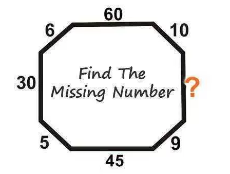
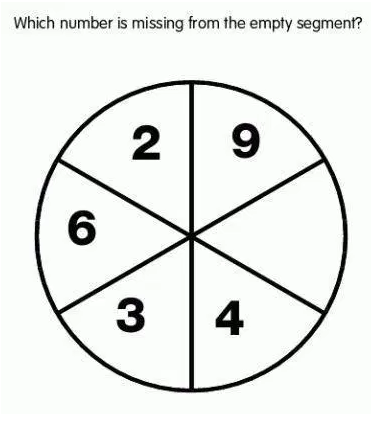
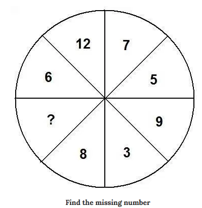
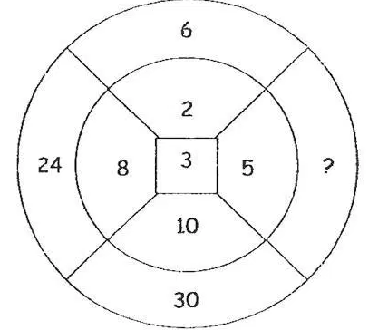

# Logical Operators and More Conditionals

Week 1 - Logical Operators and More Conditionals

### Basic Requirments

1.Is the ! operator a unary operator, or binary operator?

2.Evaluate each of the following expressions first on a whiteboard, and then in a console:

```
 !(2 >= 2) 
 !(4 === 4) 
 !(5 !== 5)
```

3.Evaluate each of the following expressions first on a whiteboard, and then in a console::

```
 1 > 2 || 2 > 2 || 3 > 2 
 5 < 5 || 75 < 74
```

4.Translate each sentence into code:

 'Either it is warm today, or it is cold today.' 
 'That dog is either a french bulldog or a boston terrier.'

5.What should the value of x be to make the expression true? How about false?

```
 var x = ???; 
 x > 5 && x <= 12;
```

6.Translate each sentence into code::

 'It is cold and raining outside.' 
 'That cat is hissing and growling.'

7.A man named 'Joe' keeps crashing his rental cars that your function rentalCar (previous module), is in charge of. The manager has decided to add him to the 'banned' list, which will never allow him to rent a car from the company again. Please update rentalCar so that he will never be able to renta again.

8.Write a function called scoreToGrade that accepts a number as a parameter and returns a string representing a letter grade corresponding to that score.

```
 function scoreToGrade(score) { 
 // TODO: your code here 
 } 
 scoreToGrade(95); // => 'A' 
 scoreToGrade(72); // => 'C'
```

9.Modify the scoreToGrade function so that it returns 'INVALID SCORE' if the score is greater than 100 or less than 0.

### More Practice

1.Think of at least three activities that you enjoy doing outdoors and the range of temperatures and weather patterns (e.g sunny, windy, snowy, rainy, etc.) that are best for these activities. Write a function whatToDoOutside that accepts a temperature and condition as parameters and outputs a string of the format: 'The weather is ideal for: '. Make sure to include an else that indicates what should be done if the conditions do not match any activities. If you cannot think of any, here are some ideas:

 Snow Sports: snowboarding, skiing 
 Water Sports: surfing, sailing, swimming 
 Team Sports: basketball, baseball, football, etc.

2.The guessMyNumber function from the previous module (More Practice section) accepts a guess n and checks it against a random number from 0 to 5 -- if the guess n is greater than 5, output a different message indicating that the guess is out of bounds.

3.Modify the scoreToGrade function so that it returns 'A+/A-' for scores of 98-100/90-92 respectively. Apply the same logic for all other letter grades.

### Advanced

1.The rental car company that uses our rentalCar function has now decided that cars are available to people who are 18 or older, too (instead of 21). However, people between 18 to 21 can only rent on Mondays and Tuesdays.

Modify your rentalCar function to handle this situation.

2.You should have noticed a large amount of repetitive code when modifying scoreToGrade to accommodate + or - grades. When we do lots of repetitive things, that's a clear signal that there is a better way. Write a helper function letterGrade that accepts two arguments, letter and score, and works like this:

```
 function letterGrade(letter, score) { 
 // your code here 
 } 
 // These are examples of what a *working* function would output. 
 letterGrade('A', 95); // => 'A' 
 letterGrade('A', 91); // => 'A-' 
 letterGrade('B', 88); // => 'B+' 
 letterGrade('monkey', 160); // => 'monkey-'
```

Finally, use letterGrade to remove the repetition in scoreToGrade.

3.Alhamdullilah! We can write logical and and logical or in terms of each other and logical not using De Morgan's Laws()

 Write a function or that works like ||, but only uses ! and &&. 
 Write a function and that works like &&, but only uses ! and ||.

4.Solve the following puzzle.



5.Solve the following puzzle..



6.Solve the following puzzle...



7.Solve the following puzzle....



when you finish, send your puzzles results to Adel!
